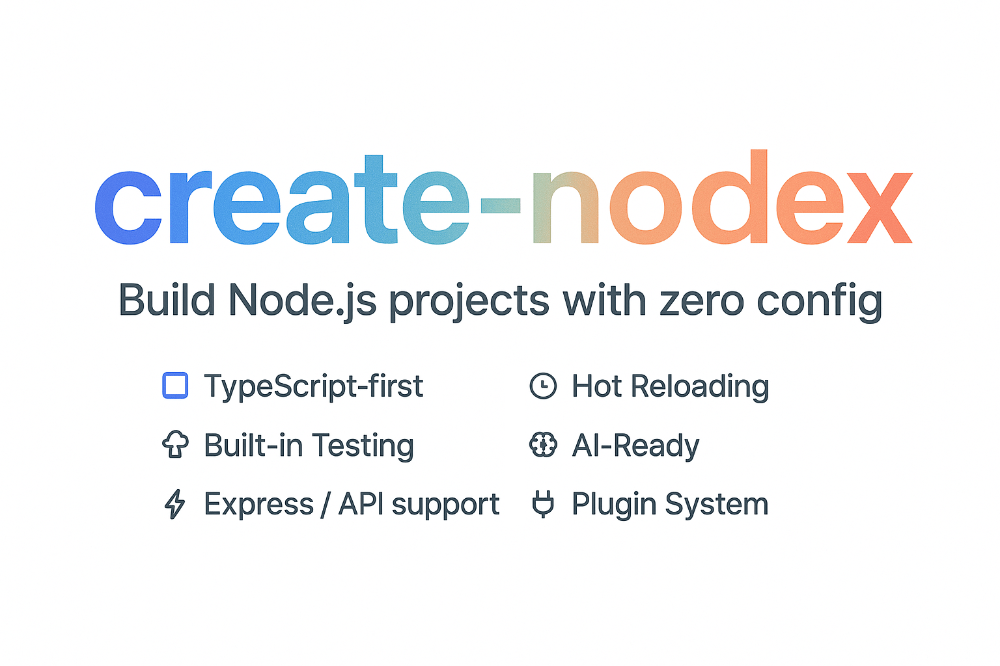

<div align="center">
  
</div>

> A powerful CLI tool for creating modern Node.js projects with TypeScript support and AI capabilities

[](https://badge.fury.io/js/create-nodex)
[](https://opensource.org/licenses/MIT)
[](http://makeapullrequest.com)

## ✨ Features

- 🎯 **TypeScript/JavaScript Support** - Choose your preferred language
- 🔄 **Hot Reload Development** - Instant feedback during development
- 🧪 **Jest Testing Integration** - Ready-to-use testing setup
- 📦 **Modern ES Modules** - Latest JavaScript features
- 🏗️ **Clean Project Structure** - Well-organized codebase
- 🤖 **AI Capabilities** - Built-in support for Langchain and RAG systems
  - Multiple LLM providers (OpenAI, Anthropic, Groq, etc.)
  - Vector store integration (Pinecone, MongoDB, FAISS, etc.)
  - Embedding model support
  - RAG (Retrieval Augmented Generation) setup
- 🚀 **Express Integration** - Add Express with a single command

## 📦 Installation

Install globally:

```bash
npm install -g create-nodex
```

Or use directly with npx:

```bash
npx create-nodex
```

## 🚀 Usage

### Creating a New Project

```bash
create-nodex [project-name]
```

#### Interactive Mode

If `[project-name]` is omitted, you'll be guided through an interactive setup:

- Project name
- TypeScript or JavaScript
- Hot reloading
- Testing setup

#### Quick Start

With project name, creates a project with default settings:

- TypeScript
- Hot Reload
- Testing

### Adding Features

Navigate to your project directory:

```bash
cd my-project
```

#### Add Express

```bash
create-nodex add express
```

This will:

- Add `express` dependency
- Create a basic `src/server.ts` (or `src/server.js`)
- Add development and production scripts
- Install required dependencies

#### Add AI Capabilities

```bash
create-nodex add ai
```

This will:

- Add Langchain integration
- Set up your chosen LLM provider
- Configure necessary dependencies
- Create example files

#### Add RAG System

```bash
create-nodex add ai-rag
```

This will:

- Set up a complete RAG system
- Configure your chosen:
  - Chat model
  - Embedding model
  - Vector store
- Create example implementation

## 🏗️ Project Structure

```
my-project/
├── src/
│   ├── index.ts (or index.js)
│   ├── server.ts (if Express added)
│   └── ai/
│       ├── common/
│       │   └── ai-setup.ts
│       ├── [model-provider]/
│       │   └── [model]-example.ts
│       └── rag/
│           └── rag-example.ts
├── package.json
├── nodemon.json (if hot-reload enabled)
├── tsconfig.json (for TypeScript projects)
├── .gitignore
└── README.md
```

## 🔧 Development

```bash
# Start development server
npm run dev:server

# Run tests
npm test

# Build for production
npm run build
```

## 🤝 Contributing

Contributions are welcome! Please feel free to submit a Pull Request.

1. Fork the repository
2. Create your feature branch (`git checkout -b feature/amazing-feature`)
3. Commit your changes (`git commit -m 'Add some amazing feature'`)
4. Push to the branch (`git push origin feature/amazing-feature`)
5. Open a Pull Request

## 📝 License

This project is licensed under the MIT License - see the [LICENSE](LICENSE) file for details.

## Acknowledgments

- [Langchain](https://js.langchain.com/) for AI capabilities
- [Express](https://expressjs.com/) for api support
- [TypeScript](https://www.typescriptlang.org/) for type safety
- [Jest](https://jestjs.io/) for testing
